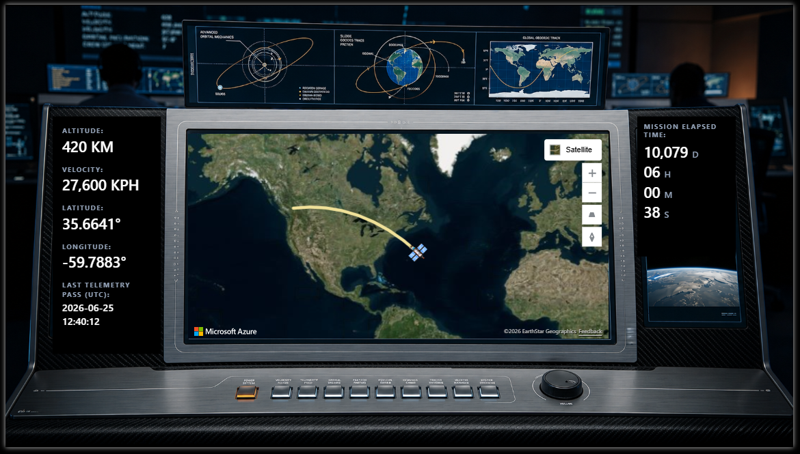

# Real-Time ISS Tracker: A Microsoft Fabric Eventstream & KQL Case Study

A live, high-throughput streaming dashboard that tracks the International Space Station (ISS) in real-time, built entirely using **Microsoft Fabric Eventstreams** and **KQL databases**.

Instead of relying on scheduled refreshes or static data loads, this architecture ingests live orbital coordinates via an API and processes them instantly. The telemetry data—including speed, altitude, and position—is continuously piped through a streaming pipeline and visualized on a dynamic command-center dashboard, showcasing how modern cloud data platforms handle sub-second data streams.
## Preview




## Key Features

- **Real-time Eventstream Ingestion:** Utilizes Microsoft Fabric Eventstreams to pull live telemetry data from the ISS API at sub-second intervals without performance lag.
- **High-speed KQL Analytics:** Leverages Kusto Query Language (KQL) to instantly parse, aggregate, and store multi-dimensional spatial data points on the fly.
- **Dynamic Geospatial Mapping:** Translates live latitude and longitude coordinates into a fluid, animated orbital path directly on the dashboard map.
- **Command-center Telemetry:** Displays real-time status indicators for critical metrics like altitude (420 km), velocity (27,600 kph), and exact mission elapsed time.

## Architecture & Data Flow

```
┌─────────────────┐
│ ISS Live API    │
└────────┬────────┘
         │ (Sub-second HTTP requests)
         ▼
┌─────────────────────────┐
│ Fabric Eventstream      │
└────────┬────────────────┘
         │ (Real-time ingestion & routing)
         ▼
┌──────────────────────┐        ┌──────────────────────┐
│ Fabric KQL Database  │◄───────│ Real-Time Dashboard  │
└──────────────────────┘        │ / Power BI           │
                                └──────────────────────┘
```

### Data Flow Steps

1. **Data Source:** A public REST API providing live tracking telemetry for the International Space Station.
2. **Ingestion Layer:** **Microsoft Fabric Eventstream** captures the continuous JSON payload streams seamlessly.
3. **Storage & Analytics:** Data is directly routed into a **Fabric KQL Database**, providing near-zero latency indexing and storage optimized for time-series geospatial analysis.
4. **Visualization:** A custom high-tech **Real-Time Dashboard** querying the KQL database to display the current position, velocity vectors, and mission metrics.

## Repository Contents

```
01_realtime-iss-tracker/
├── README.md                                    # This file
├── Project_Documentation_Realtime_ISS_Tracker_EN.pdf
├── assets/
│   ├── eventstream.png                          # Fabric Eventstream setup
│   ├── kqldatabase.png                          # KQL Database structure
│   ├── pipeline.png                             # End-to-end data pipeline
│   ├── notebook.png                             # Analysis notebook
│   ├── screenshot1.png                          # Dashboard view 1
│   ├── screenshot2.png                          # Dashboard view 2
│   ├── Workspacecontent.png                     # Workspace layout
│   └── iss.mp4                                  # Demo video
└── kql-queries/
    ├── LiveTelemetryHTML.dax                    # Live telemetry DAX queries
    └── MissionElapsedTimeHTML.dax               # Mission time calculation DAX
```

## Key KQL Queries

### Fetch Latest ISS Coordinates

```kusto
ISSTelemetryStream
| project Timestamp, Latitude, Longitude, Altitude_KM, Velocity_KPH, MissionElapsedTime
| order by Timestamp desc
| take 1
```

### Calculate Position Deltas

```kusto
ISSTelemetryStream
| extend PrevLatitude = prev(Latitude), PrevLongitude = prev(Longitude)
| extend LatDelta = Latitude - PrevLatitude, LonDelta = Longitude - PrevLongitude
| project Timestamp, Latitude, Longitude, LatDelta, LonDelta, Velocity_KPH
| order by Timestamp desc
```

## Tech Stack

- **Microsoft Fabric** – Cloud-native data platform
- **Eventstreams** – Real-time data ingestion
- **KQL Database** – High-performance analytics store
- **Power BI** – Dashboard & visualization
- **KQL (Kusto Query Language)** – Analytics queries
- **DAX** – Power BI calculations

## Real-Time Metrics Tracked

| Metric | Unit | Update Frequency |
|--------|------|------------------|
| Latitude | Degrees | Sub-second |
| Longitude | Degrees | Sub-second |
| Altitude | km | Sub-second |
| Velocity | km/h | Sub-second |
| Mission Elapsed Time | HH:MM:SS | Real-time |

## Performance Characteristics

- **Data Ingestion Latency:** < 500ms (from API to KQL)
- **Query Response Time:** < 100ms (typical dashboard refresh)
- **Data Points Per Day:** ~86,000+ (sub-second resolution)
- **Dashboard Update Interval:** 1-2 seconds

## Use Cases & Learnings

This project demonstrates:

1. **Stream Processing at Scale:** How to handle continuous, high-frequency data feeds in a cloud environment
2. **Real-Time Analytics:** Techniques for instant aggregation and complex calculations on streaming data
3. **Geospatial Time-Series:** Methods for tracking and visualizing moving objects in real-time
4. **Microsoft Fabric Integration:** Best practices for connecting external APIs to enterprise data platforms

## Getting Started

1. **Review the Documentation:** See `Project_Documentation_Realtime_ISS_Tracker_EN.pdf` for detailed setup instructions
2. **Explore the Architecture:** Check `assets/pipeline.png` and `assets/Workspacecontent.png` to understand the layout
3. **Examine the Queries:** Review `.kql` files in the `kql-queries/` folder for implementation details
4. **View Dashboards:** Screenshots in `assets/` show the final visualization

## References

- **ISS API:** https://api.wheretheiss.at/
- **Microsoft Fabric Docs:** https://learn.microsoft.com/en-us/fabric/
- **KQL Documentation:** https://learn.microsoft.com/en-us/kusto/query/
- **Power BI Real-Time:** https://learn.microsoft.com/en-us/power-bi/

---

**Last Updated:** June 2026  
**Project Status:** Production ✓  
**Data Source:** International Space Station Public API

