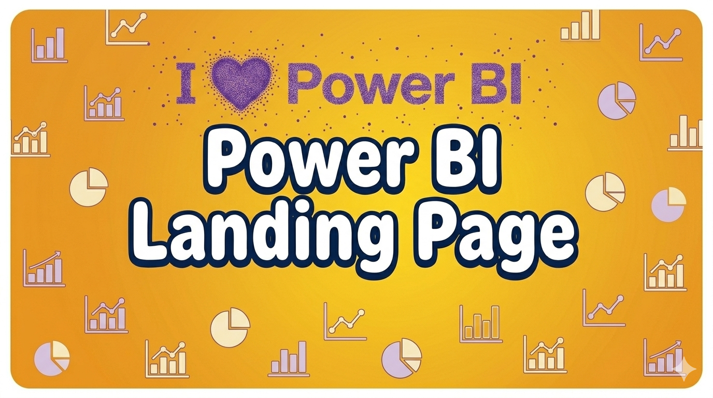
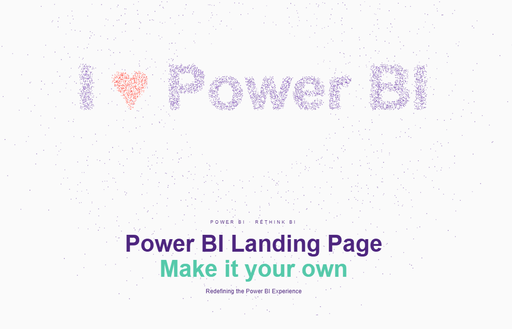
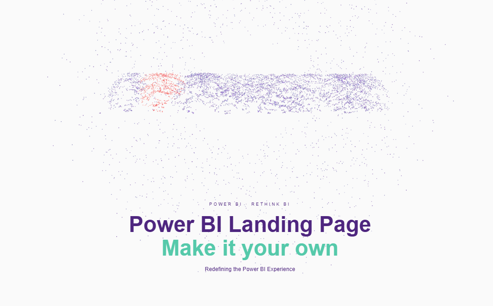
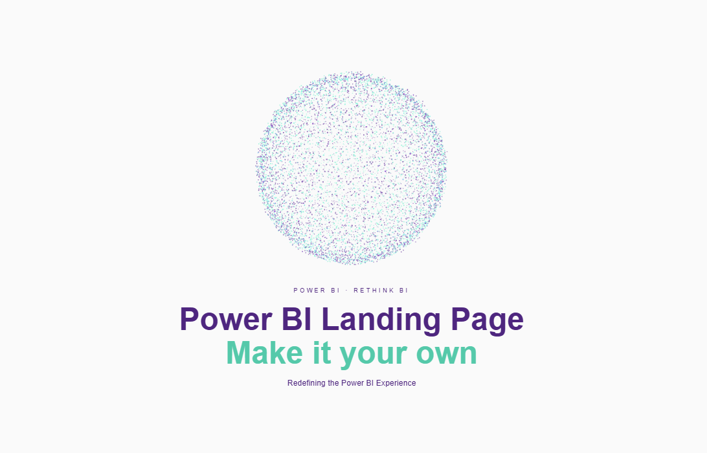

# Power BI Landing Page — Premium 3D Particle Animation

A bespoke HTML/CSS/WebGL landing page within Power BI that provides users with a premium, immersive portal experience upon entering the report environment.

## Demo

[](https://www.youtube.com/watch?v=gACAfd8Kuhs)

## About

By translating a dynamic cloud of 8,000 independent 3D particles into a fluidly morphing visual — transitioning seamlessly between a rotating cosmic sphere and sharp typography — the asset redefines report onboarding and elevates the overall presentation of enterprise analytics.

## Key Features

- **High-performance 3D particle engineering** using Three.js and WebGL for smooth fluid movement
- **Advanced canvas pixel-to-vector mapping** to transform abstract shapes into crisp, legible text elements
- **Lightweight and responsive layout** using CSS `clamp()` to ensure seamless, transparent integration across all screen sizes
- **Optimized rendering architecture** that maintains fluid animation speeds without impacting native report performance

## Make It Your Own

The code is structured to be completely modular and adaptable. The core typography, particle density, animation speeds, and the theme palette (currently configured in premium purple and mint teal) can be easily adjusted within the script to align perfectly with any corporate brand identity.

### Customizable Parameters

| Parameter | Location | Description |
|-----------|----------|-------------|
| `count` | Line ~45 | Total number of 3D particles (default: 8000) |
| `cPurple` | Line ~46 | Primary theme color |
| `cGreen` | Line ~47 | Secondary accent color |
| `cRed` | Line ~48 | Heart icon color |
| `STATE_DUR` | Line ~110 | Duration of idle state in frames |
| `MORPH_DUR` | Line ~111 | Morphing animation speed (lower = faster) |
| Text | Line ~90 | The text particles morph into |

## Screenshots

<p align="center">
  
</p>
<p align="center">
  
</p>
<p align="center">
  
</p>

## Tech Stack

| Layer | Technology |
|-------|-----------|
| BI Platform | Microsoft Power BI |
| 3D Engine | Three.js (r128) / WebGL |
| Languages | DAX, JavaScript, HTML5, CSS3 |
| Rendering | HTML Content / HTML5 Visual for Power BI |
| Layout | CSS Flexbox, `clamp()` for responsiveness |

## Usage

1. Add the [HTML Content visual](https://appsource.microsoft.com/en-us/product/power-bi-visuals/WA200001930) to your Power BI report
2. Create a new measure using the code in `landing-page-visual.dax`
3. Customize colors, text, and particle count to match your brand
4. Add the measure to the HTML Content visual's "Values" field

Or simply open `Landing_Page.pbix` directly in Power BI Desktop.

## File Structure

```
├── README.md
├── header.png                    # Project header image
├── landing-page-visual.dax       # Complete DAX measure
├── Landing_Page.pbix             # Ready-to-use Power BI file
└── screenshots/
    ├── landing-page-1.png        # Sphere state
    ├── landing-page-2.png        # Morphing state
    └── landing-page-3.png        # Text state
```

## License

MIT
