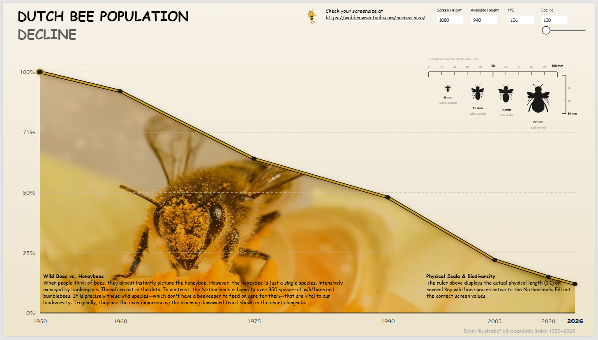

# True Scale Data Viz: The Wild Bee Crisis

When people think of bee extinction, they often think of honeybees. But honeybees are managed by beekeepers. The deeper crisis is happening to wild bees.

This project visualizes the decline of wild bee populations and combines two perspectives in one Power BI experience:

1. Macro trend: an area chart showing the decline since 1950.
2. Micro world: a true-scale ruler view showing four wild bee species from 6 mm to 22 mm at 1:1 scale on screen.

## Repository Linking

Use this folder URL in portfolio projects:

https://github.com/GeronimoAnalytics/data-portfolio/tree/main/wild-bee-crisis

## Preview Asset

